# Maak onderdelen
Om de robot arm op de AMR te plaatsen is een tussen frame nodig. Hier zal ook meteen alle besturingsonderdelen van de MoMa in worden geplaatst. Het frame bestaat uit 4040 en 2020 aluminium frames met beplating er omheen voor stevigheid en afscherming. In het frame zit de besturingskast van de robot arm, safety PLC, embedded AI computer, router en bedingingspaneel met noodstop. De beplating is watergesneden, gebogen, getapped en verzonken. verder zijn er een aantal onderdelen 3D geprint, dit zijn: trap sensoren, houder embedded AI computer, besturingspaneel houder en de kabel buis houders. Dit is geprint met een FDM printer op de trap sensoren na. Deze zijn met een resin printer gemaakt.

## 1. Benodigde onderdelen
1. 2020 ISB aluminium profiel 450mm lang 2X (met M6 getapped gat aan beide kanten)
2. 4040 ISB aluminium profiel 450mm lang 5X
3. ISB M6 t-sleuf 8 moer 20X
4. ISB M5 t-sleuf 5 moer 10X
5. M5X12 verzonken inbus bout 10X
6. M5X20 verzonken inbus bout 4X
7. M5X40 verzonken inbus bout 6X
8. M6X12 verzonken inbus bout 20X
9. 5mm aluminium plaat (voor watersnijden)
10. 3mm aluminium plaat (voor watersnijden)
11. 2mm aluminium plaat (voor watersnijden)
12. M3 inserts 16X (voor de kabel buis 3D print)
13. M6 schroefdraad 500mm lang 5X
14. M6 dopmoer met veer ring en ring 5X
15. M6 moer met ring 1X
16. M10X35 bout met veer ring 2 ringen en een moer 4X

## 2. SolidWorks
Alle onderdelen zijn gemaakt in SolidWorks. Hierin is ook een totaal assembly gemaakt van de MoMa. Hieronder is een renders daarvan te zien.

## 3. 3D prints
De 3D prints zijn gemaakt door een bambu lab en anycubic printer maar een andere 3D printer zou ook moeten werken. De trap sensoren zijn gemaakt door de anycubic 3D printer. Dit is een resin printer, hier is voor gekozen omdat het een best complex onderdeel is met een clip systeem en overhangs. Een resin printer kan dit beter printen dan een FDM printer. De rest van de onderdelen zijn wel geprint door een FDM printer. Dit omdat dit sneller is en minder moeite kost met schoonmaken.

### 3.1 FDM printer
Op de FDM printer zijn de volgende 3D prints genaakt: (als ergens 2X voor staat moet deze 2 keer worden geprint en bij 4X 4 keer)
1. 2X kabel beugel 1.stl
2. 2X kabel beugel 2.stl
3. 2X kabel beugel groot1.stl
4. 2X kabel beugel groot2.stl
5. 4X kabel beugel 3.stl
6. 4X tussen blok controller en top plate.stl
7. 3D print jetson holder boven.stl
8. 3D print jetson holder onder.stl
9. LD 90 panel 3d print.stl

### 3.2 Resin printer
Op de resin printer zijn de volgende 3D prints genaakt:
1. sensor blok L V1.2.stl
2. sensor blok M V1.2.stl
3. sensor blok R V1.2.stl

## 4. Watersnijden
De volgende onderdelen zijn water gesneden: ( als er 2X in staat moet deze 2 keer worden watergesneden. het aan mm van het materiaal zit ook in de naam)
1. 2X side laser holder 2mm.DXF
2. 2X zei plaat 2mm.DXF
3. 3d camera holder 2mm.DXF
4. achterplaat elektra 2mm.DXF
5. Flat pattern - achter plaat sheet metal 2mm.DXF
6. Flat pattern - voor plaat sheet metal 2mm.DXF
7. top plate ld90 3mm.DXF
8. top top plate ld90 5mm.DXF
9. tussen plaat 2X 3mm.DXF
10. tussen plaat met ronding 2X 3mm.DXF

Dit is gedaan met de OMAX 2652 watersnijder:
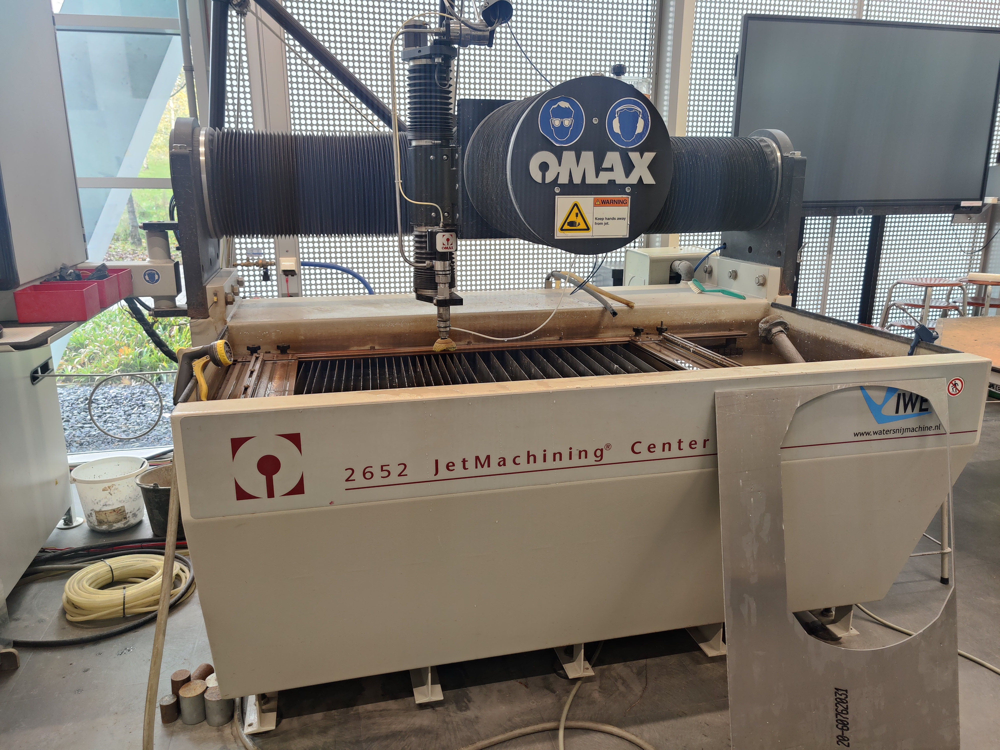

### 4.1 Buigen
De voor en achter plaat van het frame moeten worden gebogen. Het is handig om eerst een test strip te maken en die te buigen. De voorplaat heeft een lengte nodig van 655,59mm voor de test strip is het handig om deze te af te snijden op een hoogte van 100mm. De achter plaat heeft een lengte van 633,82 en ook hier is het handig om de test strip een hoogte van 100mm te doen. De volgorde van het buigen is eerst de ronding doen en daarna met de kantbank vanaf de buiging naar het einde te werken. De afmetingen en rondingen van de buigen zijn te vinden in de SolidWorks tekening van de betreffende onderdelen. De watergesneden top plate voor de LD-90 is ook goed te gebruiken als referentie bij het buigen. Een voorbeeld van de gebogen test strips is hieronder te zien:

De uiteindelijke platen moeten worden gesneden op een hoogte van 450mm in plaats van de 100mm van de test strips. Ook is het belangrijk om voor het buigen eerst de bramen op de randen weg te halen met vijl en de gaten te verzinken voor een M4 verzonken inbus bout. De test platen kunnen tijdens het buigen ook handig als referentie worden gebruikt.

### 4.2 Verzinken en tappen
De 4 tussenplaten moeten worden getapped met een M4 tap. Verder moeten de voor, achter en zei platen worden verzonken voor een M4 verzonken inbus bout. Let op bij het verzinken dat dit aan de juiste kant wordt gedaan. De voor en achter plaat maakt niet uit maar moet je er vervolgens wel rekening mee houden bij het buigen. Voor de 2 zei platen is het belangrijk dat ze beide aan een andere kant zijn verzonken want deze zijn op die manier gespiegeld. Verder moet er voor de top plate en top top plate verzonken worden voor M6 en M5 verzonken inbus bouten volgens de SolidWorks tekening.

## 5. Trap sensor
Omdat het helaas een keer is gebeurd dat een geleende LD-60 van de trap is gevallen bij NHL-Stenden door de afwezigheid van een trap sensor, hebben we er voor gekozen om een zelfgemaakte trap sensor toe te voegen. Deze zal worden aangesloten op de UserBumper_1-3. Dit werk door een ToF sensor die schuin naar voren kijkt en de data naar een esp32 stuurt. zodra deze een verhoging of verlaging van 30 mm tegen komt zal deze een relais triggeren welke is aangesloten op de UserBumper_1-3 van de LD-90. Hieronder is een programma geschreven in arduino IDE welke te vinden is onder de map trap beveiliging. Hier moet nog een stuk worden toegevoegd voor de WS2812 leds welke in de behuizingen worden geplaatst van de sensoren om de status weer te geven. Hieronder zijn wat renders te zien over hoe het er uit zou moeten zien:

Vooraanzicht 3 trap sensoren             |  Ingezoomd op 1 trap sensor
:-------------------------:|:-------------------------:
  |  

Er is ook een PCB ontworpen voor de trap sensor. De altium bestanden hiervan zijn te vinden in de map trap beveiliging/altium.
Hieronder is een foto te zien van de gemaakte PCB in altium:

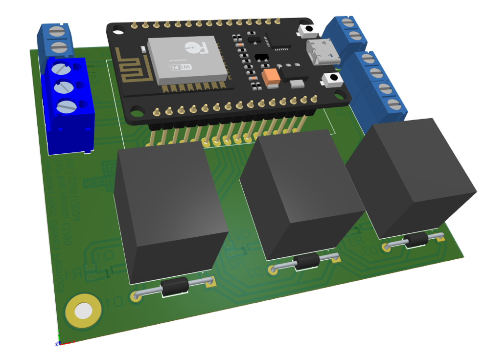

## 6. Monteren en demonteren

### 6.1 Monteren
De montage/demontage van het frame moet met minimaal 2 personen worden gedaan. Dit wegens het gewicht, grote en kostbaarheid.

Bij onduidelijkheden kan je ook kijken naar de SoldWorks assembly, daar is alles te zien zoals de bouten en moeren.

1. Haal de bovenplaat van de LD90 eraf (let op dat er kabels voor de antenne's en HMI aan de LD90 zitten en dat deze niet heel lang zijn).
2. Demonteer de antenne's en de HMI van de bovenplaat. De antenne kabels en de HMI kabel mag bevestigd blijven aan de LD90. De HMI en antenne's moeten wel los worden gehaald van de kabels, deze worden er later weer opgezet.
3. Bevestig de molex connectoren met kabels aan de LD90 IO zoals op onderstaande afbeelding.
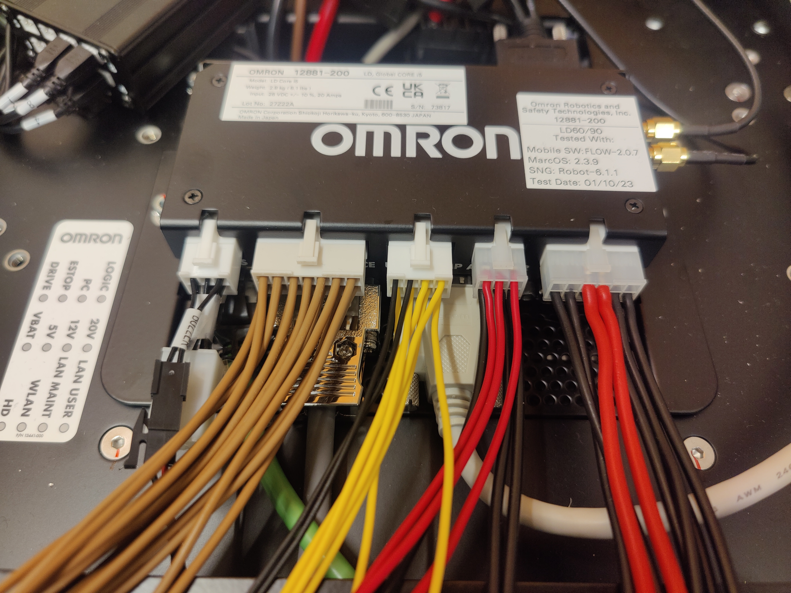

4. Maak de kabels netjes bij elkaar met tie wraps en een spiraalband. Leg alle benodigde kabels bij elkaar aan de voorkant van de LD90, hier zit het gat in de bovenplaat waar de kabels doorheen moeten. Zie onderstaande foto als voorbeeld.
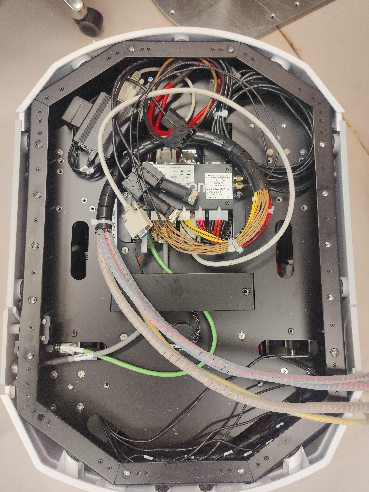

5. Vervolgens kan de bovenplaat worden voorbereid voor de montage. Bevestig de robotarm besturingskast en 2020 aluminium frames aan de bovenplaat met M6 verzonken inbus bouten en bevestig 1 van de M6 stafen aan de bovenplaat. De M6 staaf moet wel met een moer en ring aan de onderkant worden bevestigd. Zie onderstaande foto's voor verduidelijking.

Overzicht             |  Moer onder bovenplaat
:-------------------------:|:-------------------------:
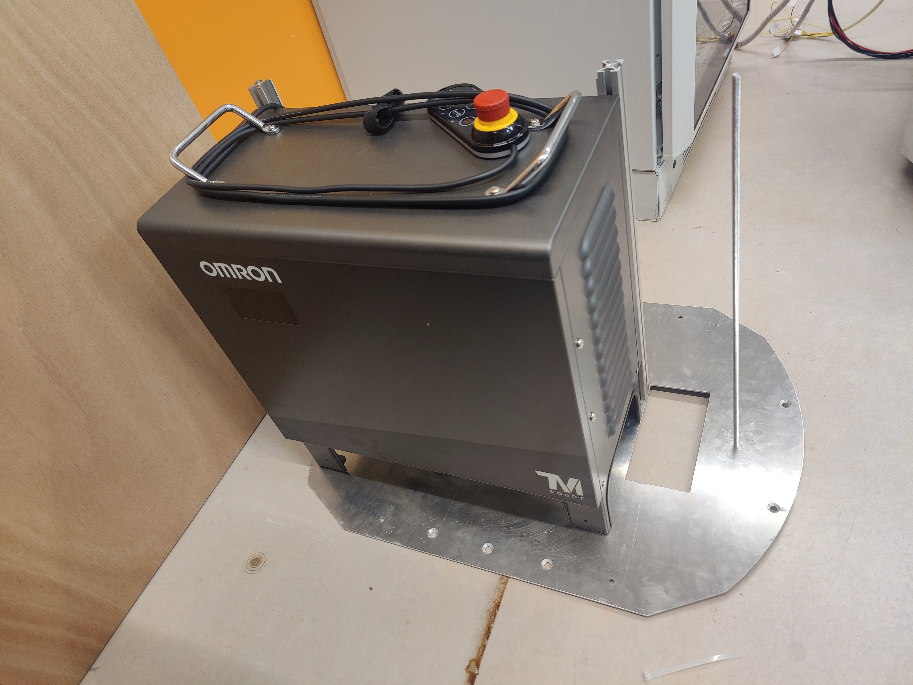  |  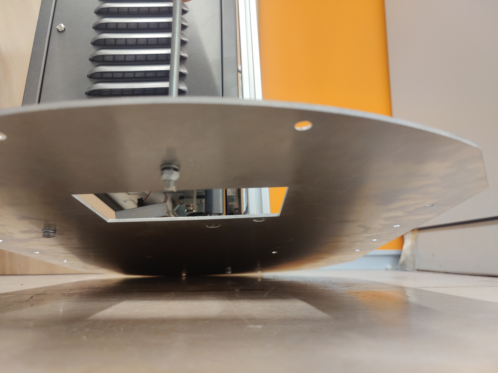

6. Plaats nu de bovenplaat op de LD90. Doe dit met minimaal 2 mensen, 1 iemand die de bovenplaat met besturingskast op de LD90 plaatst en 1 iemand die de kabels door het vierkante gat begeleidt. Dit ziet er dan als volgt uit:
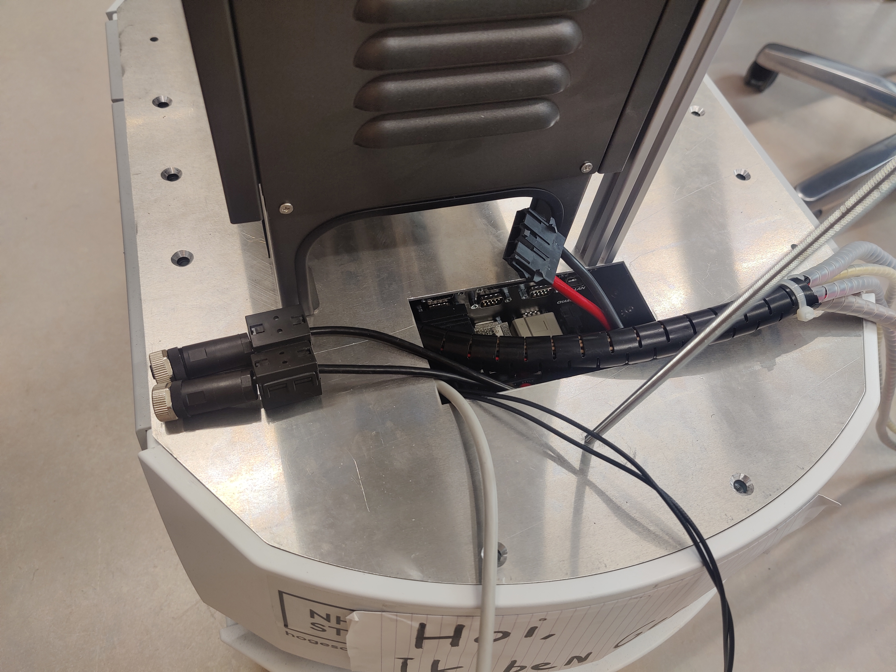

7. Bevestig nu een internet kabel aan de user LAN van de LD90. Zie onderstaande foto van de user LAN.
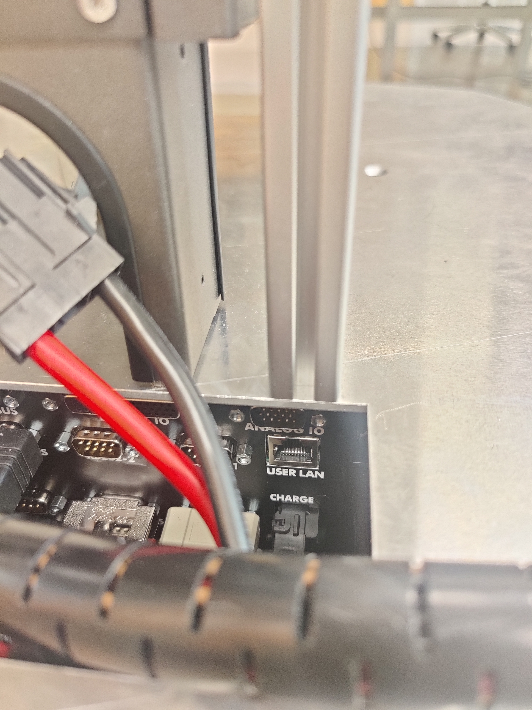

8. Plaats de besturingskast op de 2 2020 aluminium profielen en sluit alle kabels aan.

9. Schroef nu de 4 overige M6 stafen aan de bovenplaat. Zie onderstaande foto's voor verduidelijking.
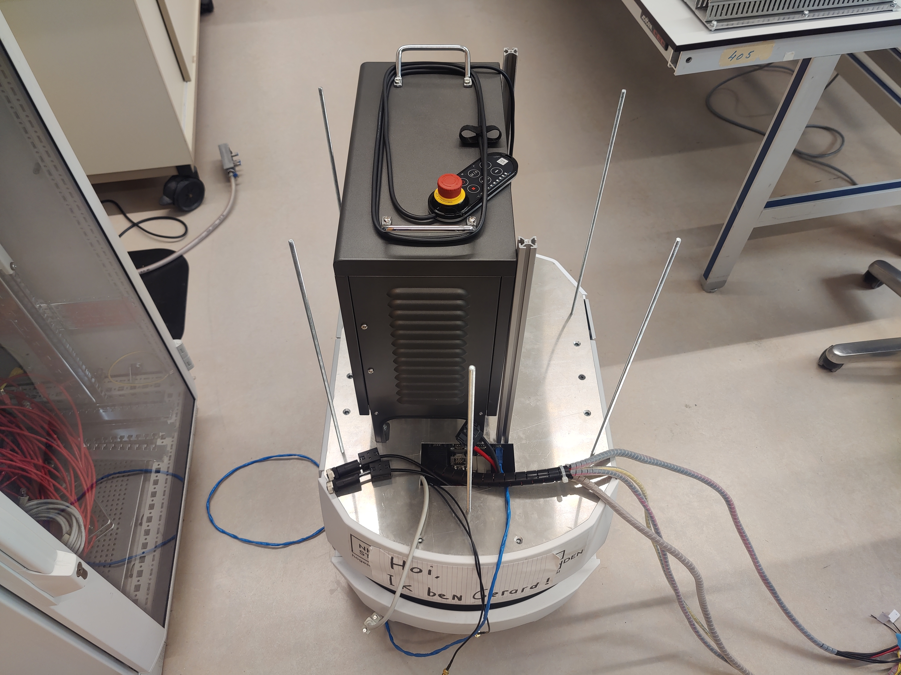

10. Bereid de 2 zei platen voor. Hiervoor zijn de volgende onderdelen voor nodig: 4 4040 profielen, 2 zei platen, 2 tussen platen, 2 tussen platen met ronding, 2 side lasers, 2 side laser bevestigingsplaten, 8 M4 verzonken inbus bouten, 6 M6 verzonken inbus bouten en 16 M6 T-sleuf moeren. Zie onderstaande foto van hoe het er uiteindelijk moet uitzien.
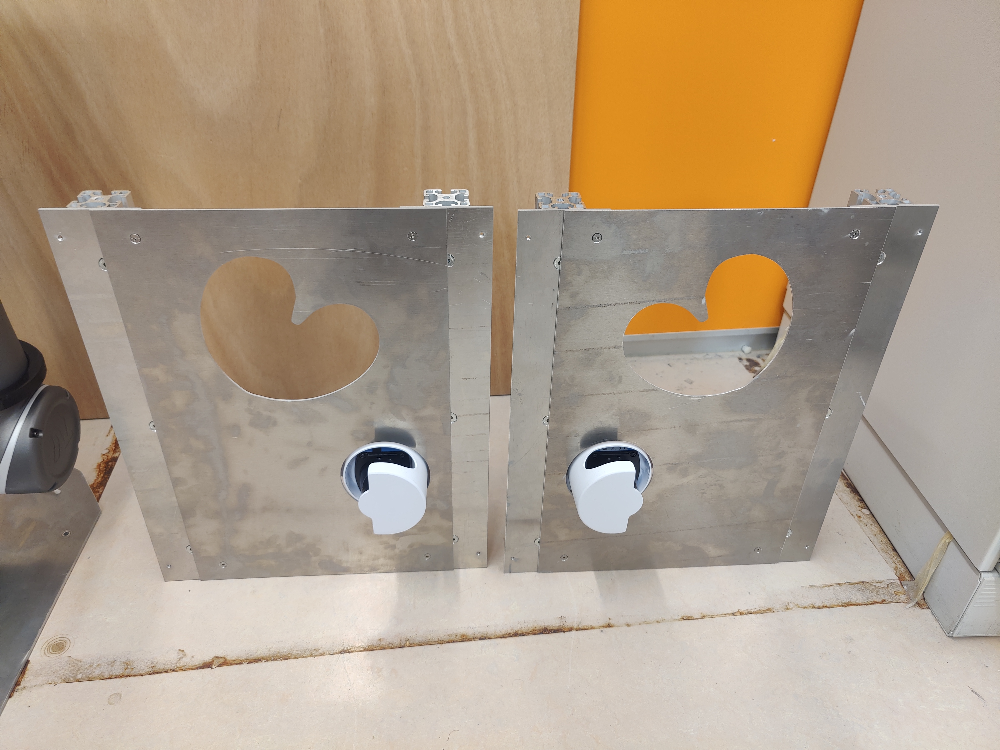

11. Plaats de 2 zei platen op de 4 M6 stafen, en plaats de laatste 4040 profiel op de M6 staaf midden voor.

12. Bevestig de HMI en entenne extender kabels op de achterplaat van de LD90. Zie onderstaande foto van de bevestiging van de HMI met de 3D print.

Vooraanzicht             |  Achteraanzicht
:-------------------------:|:-------------------------:
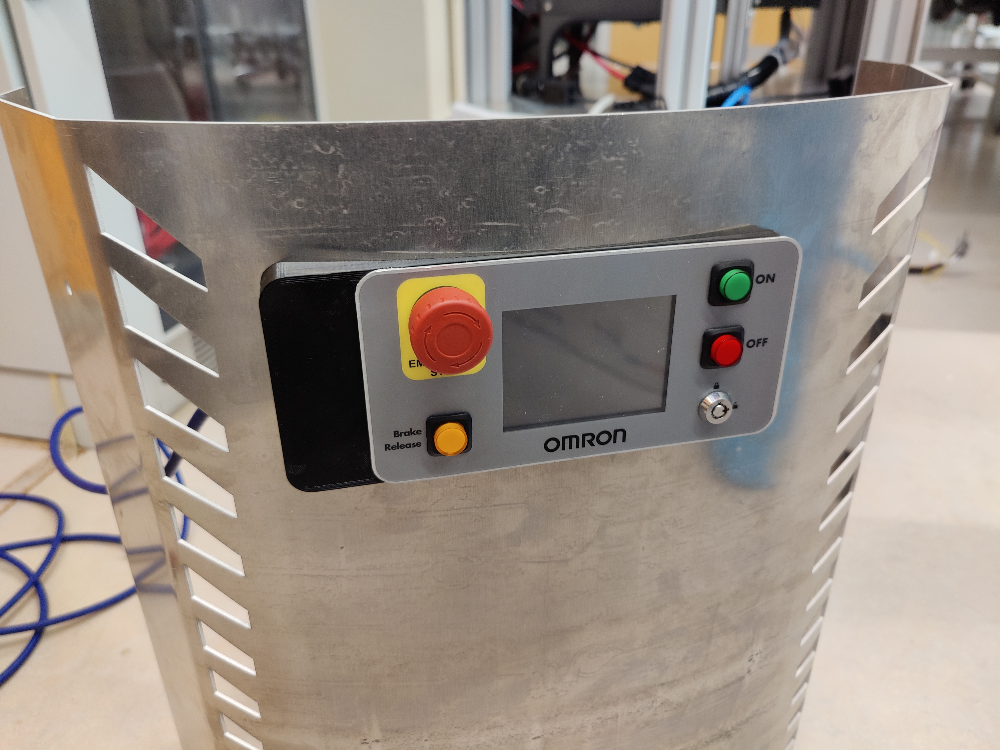  |  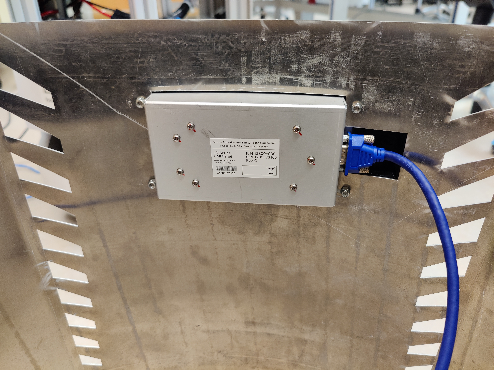

## 6.2 Demonteren
